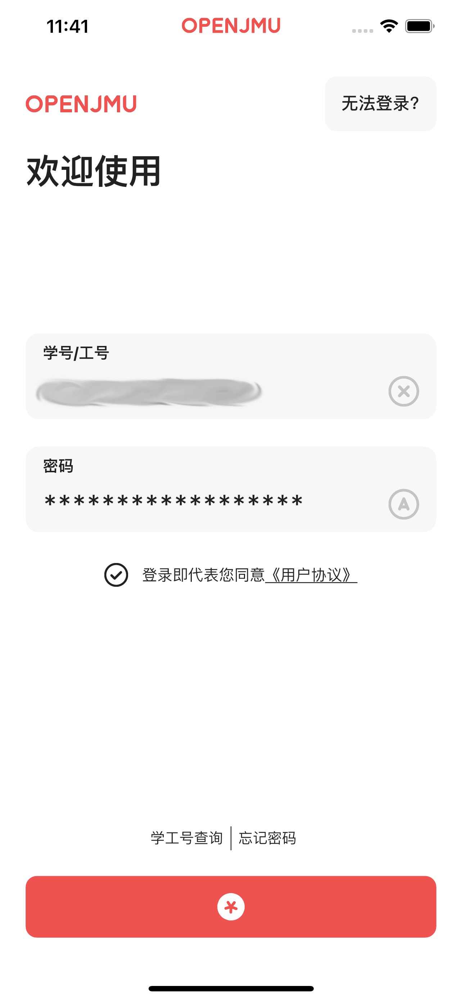
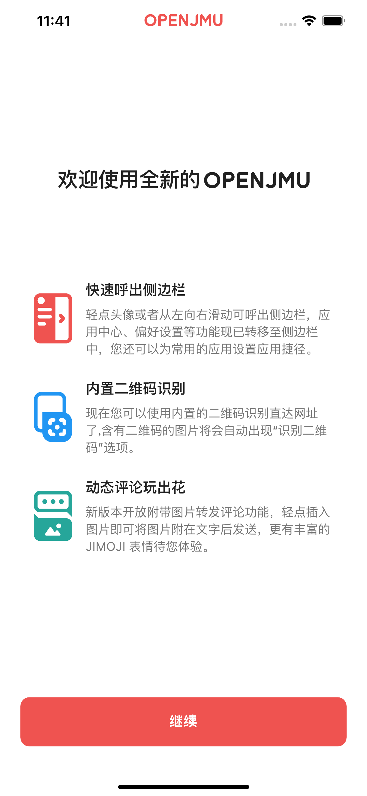
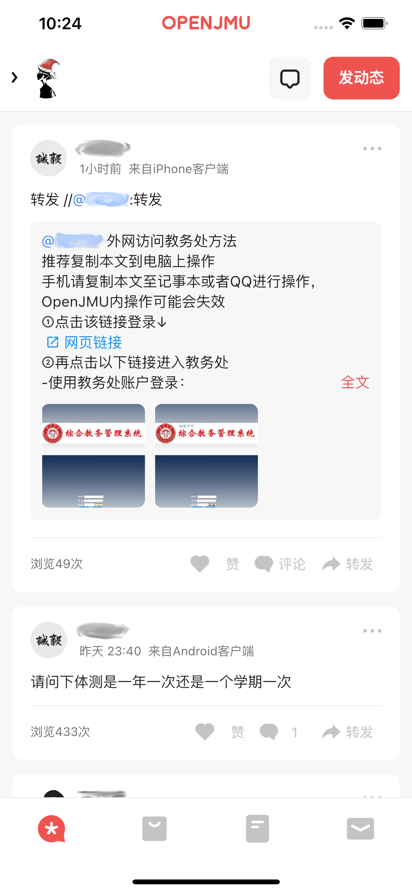
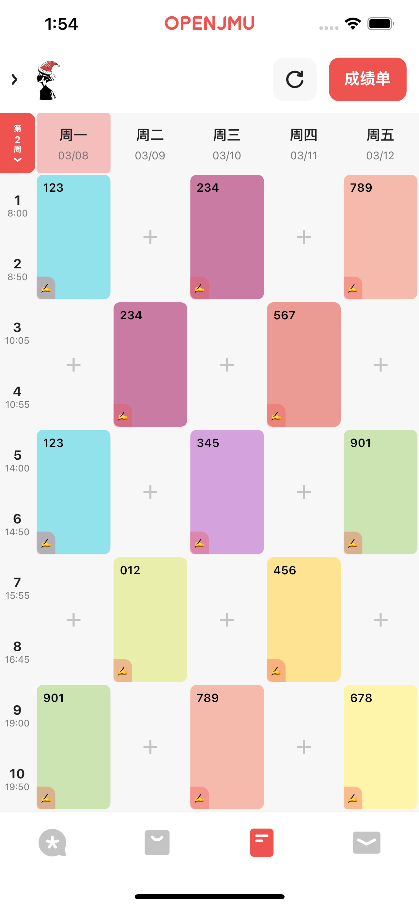
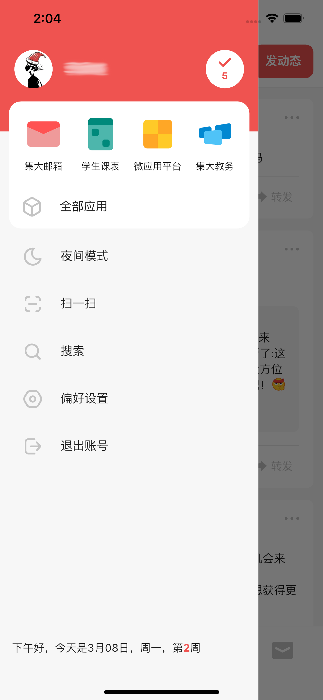
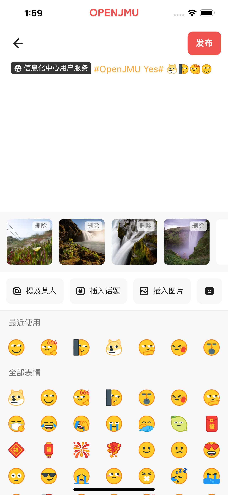
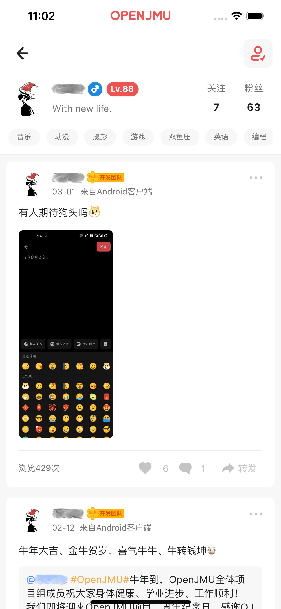
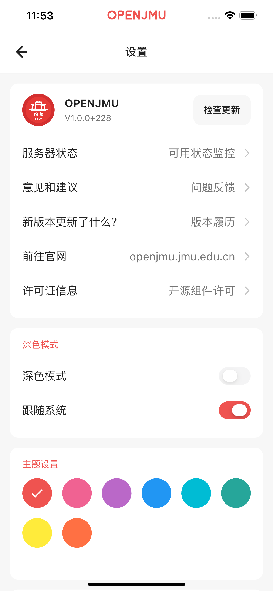

# OpenJMU

使用 [Flutter](https://flutter.dev/) 对 [集大通](http://99.jmu.edu.cn/) 进行重写的客户端。

Rebuild from [JiDaTong](http://99.jmu.edu.cn/) client using [Flutter](https://flutter.dev/).

**注意：由于登录体系不对外公开，如果您非本校（集美大学）成员，以任何方式均无法正常登录。**

**Notice: Due to non-public user service, you can't login to this app
if you are not a member of JMU (JiMei University).**

[更新日志](CHANGELOG.md)

## 为什么用Flutter？ Why flutter ?

Flutter是一套跨平台开发框架，能很好地在接口完备的情况下快速构建所需功能，只需负责 UI 逻辑层。

Flutter is a framework which can cross platform,
it can create features when the apis is supported, and we just need to handle with UI layer.

## 为什么要重写？ Why needs to rebuild ?

原本的应用为外包公司制作，由于学校网络建设策略的原因已经停止维护。
应用在各平台上均有大大小小的问题，影响到用户的正常使用。
更新应用能让师生群体均获得更好的应用体验，同时可以扩展新功能。

The older app is developed by other team,
which has been stop maintained due to school's network construction policy.
It occurs various of problem on each platform, makes users hard to use the app.
By rebuild this app, users can get better experience when using this app,
and new feature can be extended.

## 项目无法登录，有什么参考价值？ What kinds of value while the app cannot login?

目前阶段我们无法提供体验账号。如果你对其中的某个实现或组件或依赖使用感兴趣，
可在 QQ 群 FlutterCandies(181398081) 找到我，咨询相关问题。

We cannot provide any account for test due to policy reason at present stage.
If you're interested in some feature/widget/dependencies usage,
you can find me at `FlutterCandies`(181398081) QQ group or file an issue to ask related questions.

## 8多说，上图！ Let's see some screenshots !

|  |  |  |
| ---------------------- | ---------------------- | ---------------------- |
|  |  |  |
|  |  |  |
