# OpenJMU

使用 [Flutter](https://flutter.dev/) 对 [集大通](http://99.jmu.edu.cn/) 进行重写的移动端客户端。

Rebuild from [JiDaTong](http://99.jmu.edu.cn/) client for mobile using [Flutter](https://flutter.dev/).

# 为什么要重写？ Why needs to rebuild ?

原本的应用为外包公司制作，由于学校网络建设策略的原因已经停止维护。应用在各平台上均有大大小小的问题，影响到用户的正常使用。

更新应用能让师生群体均获得更好的应用体验，同时可以扩展新功能。

The older app is developed by other team, which has been stop maintained due to school's network construction policy. It occurs various of problem on each platform, makes users hard to use the app.

By rebuild this app, users can get better experience in using this app, and new feature can be extended.

# 为什么用Flutter？ Why flutter ?

Flutter是一套跨平台开发框架，能很好的在接口完备的情况下快速构建所需功能，只需负责UI逻辑层。

Flutter is a framework which can cross platform, it can create features when the apis is supported, and we just need to handle with UI layer.

# 8多说，上图！ Let's see some screenshots !

## 动效 Animations and Transitions

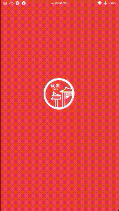
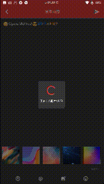

## 截图 ScreenShots
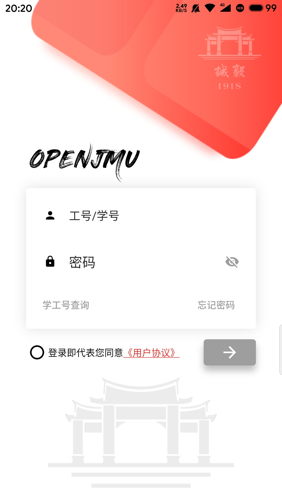

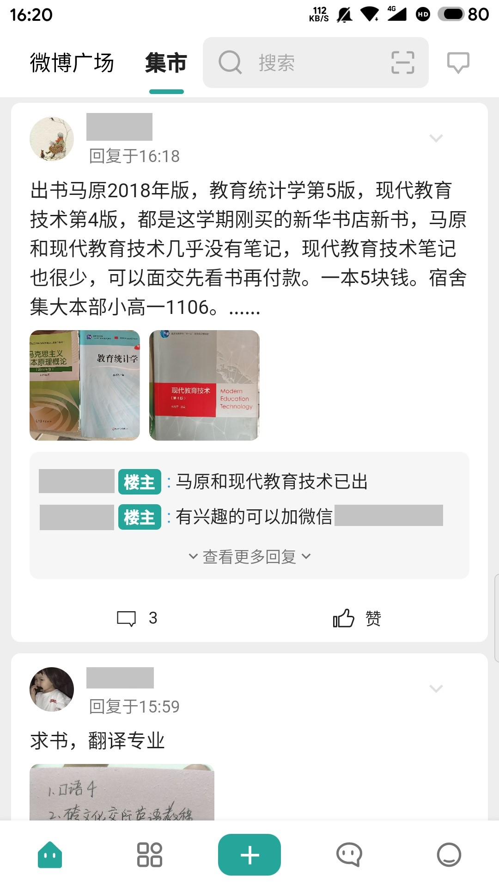

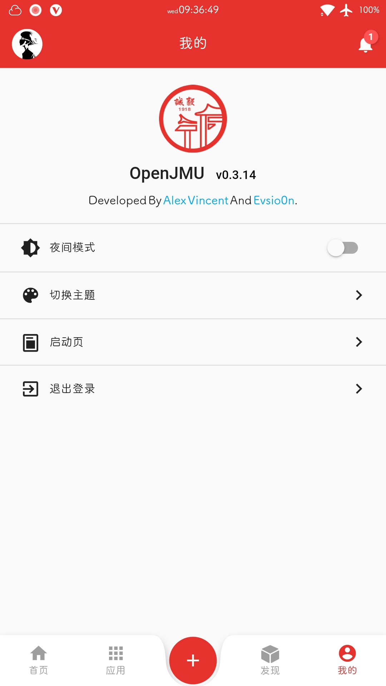
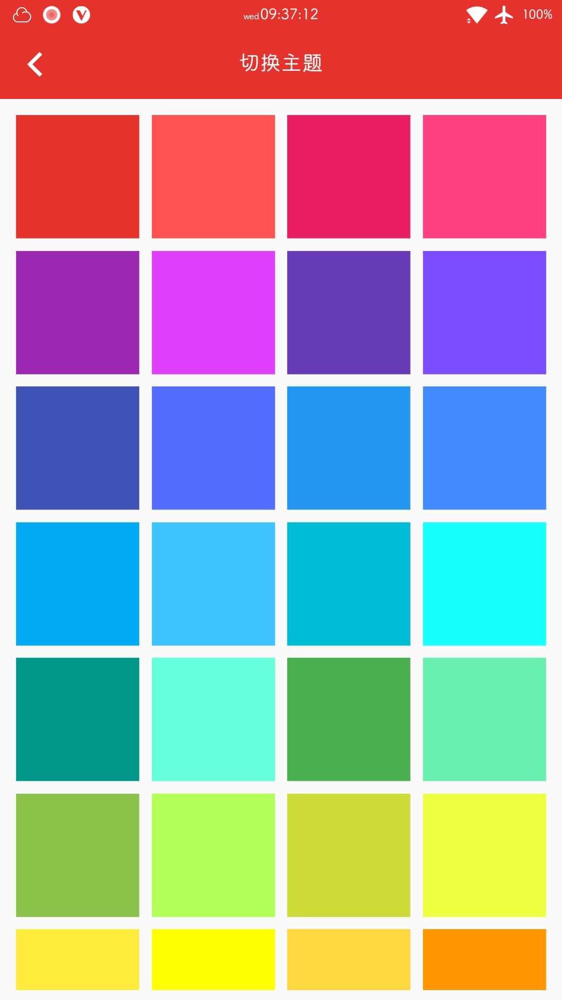
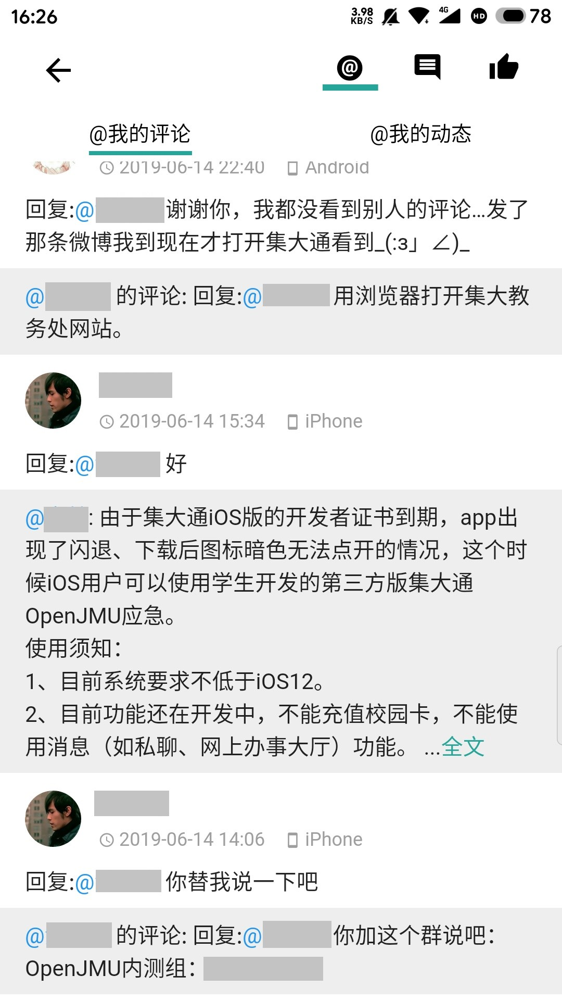

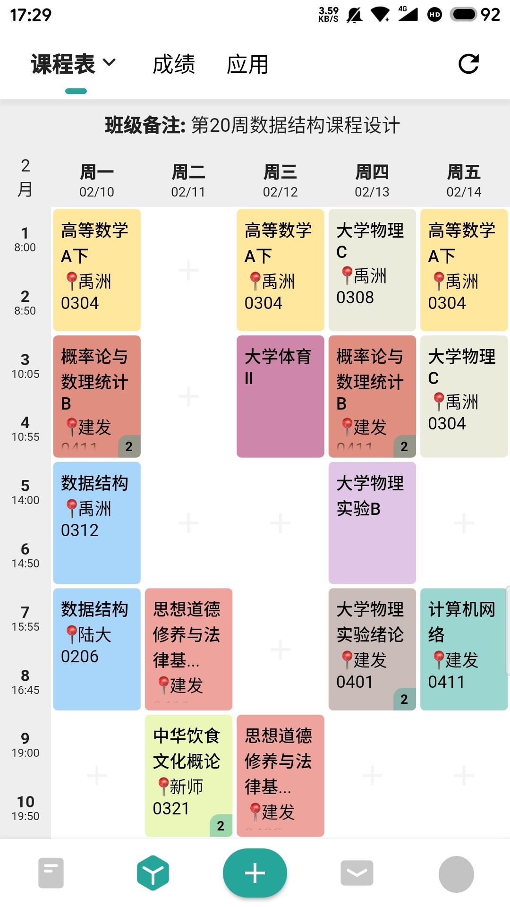
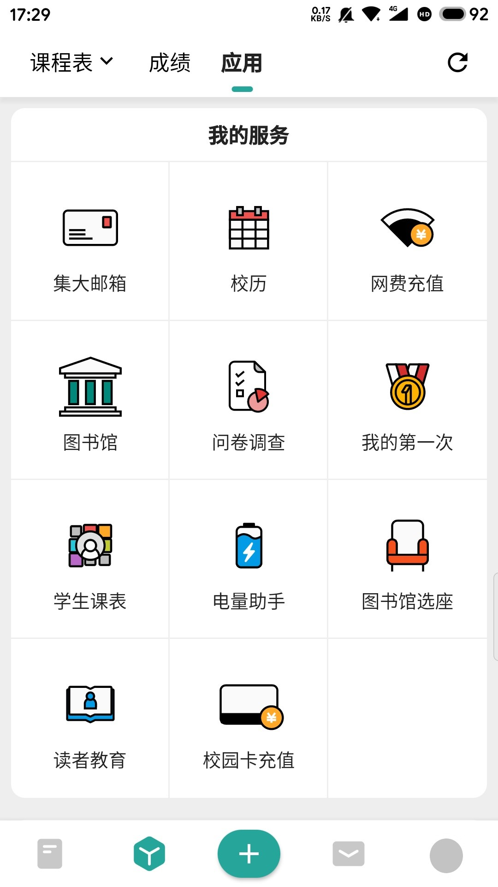
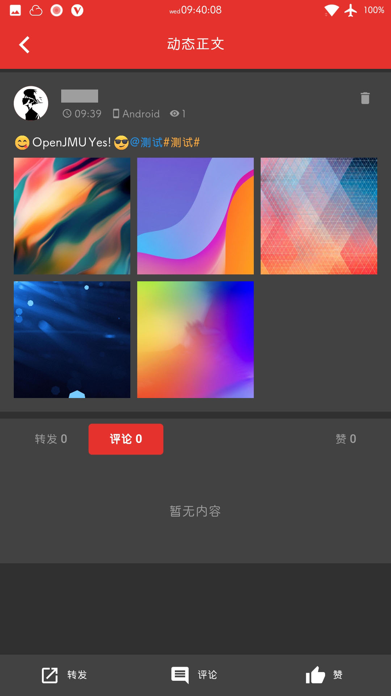

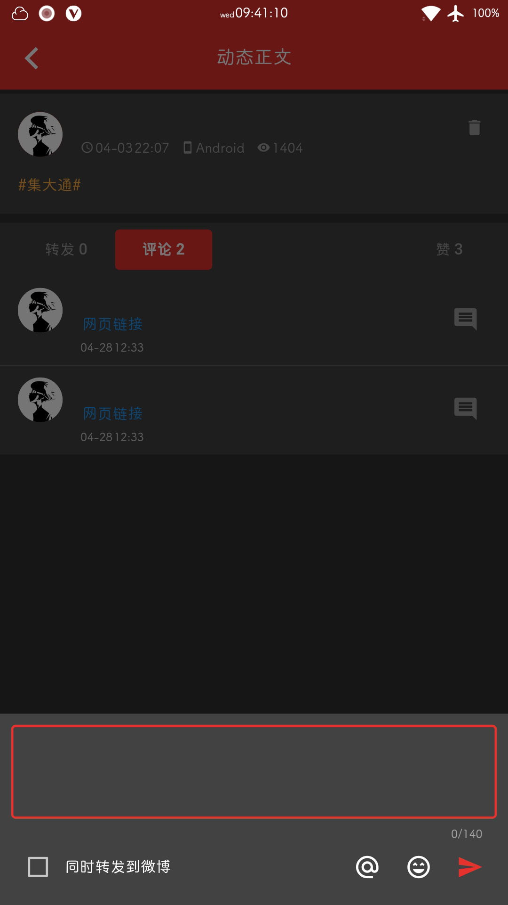
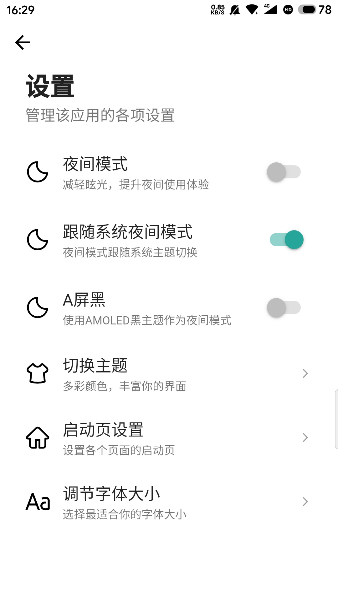
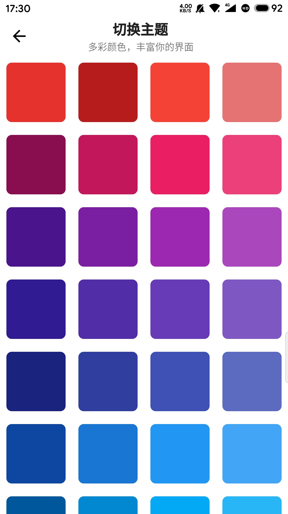

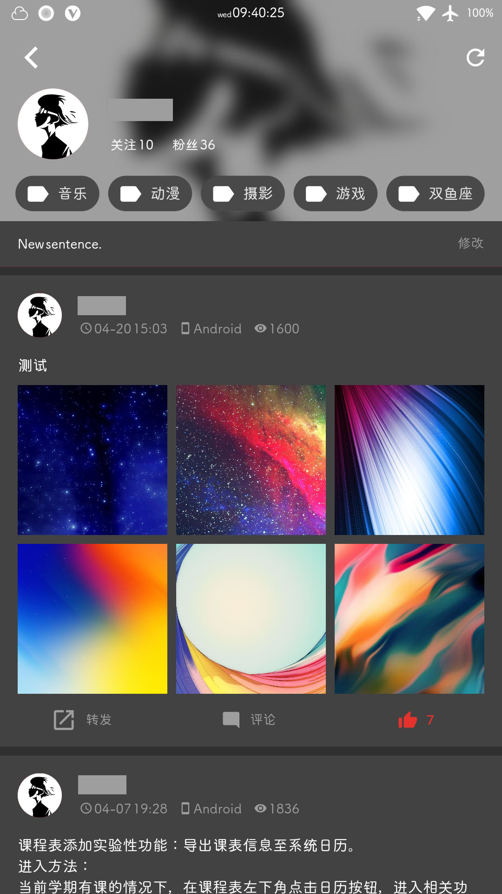
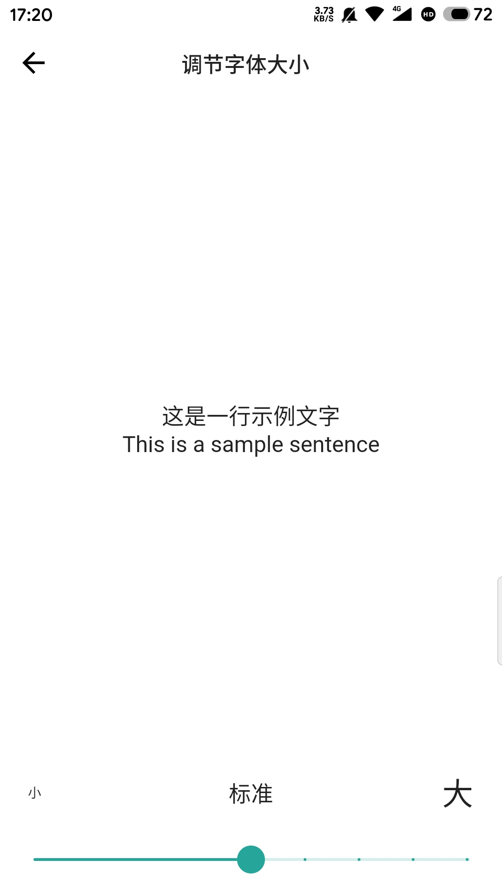
